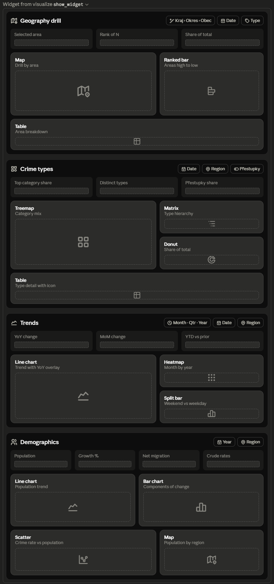

Here are scatter ideas that actually fit your data — each leans on a different encoding (X, Y, bubble size, color, and Power BI's **Play axis** for time). Grouped by what they reveal:

## Crime hotspot & priority
| Idea | X | Y | Size | Color | Reveals |
|---|---|---|---|---|---|
| **Hotspot quadrants** | Incidents (volume) | Crime rate /1k | Population | Kraj | high-rate *and* high-volume = act first |
| **Priority matrix** | Crime rate /1k | YoY % change | Incidents | — | "high & worsening" (top-right) vs "improving" |
| **Over/under-represented** | Population | Incidents | — | Kraj | add an *expected* line (`rate_national × pop`); points above = more crime than population predicts |
| **Volume vs clearance** | Incidents | Clearance % | Population | Kraj | do busy areas solve less? (needs `d_state`) |

## Crime × demographics (the interesting cross-domain ones)
| Idea | X | Y | Size | Color | Reveals |
|---|---|---|---|---|---|
| **Growth vs crime** | Net migration rate | Crime rate YoY % | Population | Kraj | does crime follow growing/shrinking towns? |
| **Type co-occurrence** | Property crime rate | Violent crime rate | Population | Okres | which places have both |

## Demographics-only (for the demographics page)
| Idea | X | Y | Size | Reveals |
|---|---|---|---|---|
| **Births vs deaths** | Crude birth rate | Crude death rate | Population | add a `y = x` diagonal — below it = naturally growing |
| **Two engines of change** | Natural increase rate | Net migration rate | Population | four quadrants: booming / hollowing / aging-but-attractive / declining |

## Three techniques that make any of them "cool"
- **Play axis = Year (2013–2026).** Turn any scatter above into an animation and watch areas travel. This is the single biggest wow-factor and it's free with your `mv_d_date[Year]`.
- **Quadrant reference lines.** In the Analytics pane add median X + median Y lines (and optional shading) to turn a cloud into a 2×2 story — pairs perfectly with the priority matrix.
- **Ratio / trend line.** The Analytics pane's ratio line gives you that "expected incidents" diagonal for residual analysis at no extra modeling.

Two practical notes: with ~6,000 obce, use the scatter's **high-density sampling** mode (or drill at kraj/okres level) so it stays responsive; and the growth/type-correlation ones want population and per-capita rates on both axes so big cities don't dominate — which your new measures already give you.

My pick for the geography page's scatter slot: the **hotspot quadrants** with a **Year play axis** — it's the most legible and the animation sells it. Want me to spec that one out (exact fields, measures, and reference lines), or mock it as a wireframe tile?

Here are the other four pages, keeping the same visual language and shared global slicers as the overview.

Rationale behind each layout:

- **Geography drill** — map + synced ranked bar is the core "where" view; the `Kraj › Okres › Obec` breadcrumb maps to your `mv_d_uzemi` hierarchy and the bidirectional map relationships. KPI strip surfaces the selected area's rank and share (the "rate rank" KPI we discussed).

- **Crime types** — treemap for category mix (leans on your `d_type`/`d_type_group` hierarchy), a hierarchy matrix for drill, and a donut for share. The detail table is where your `Icon SVG` measure shines as a category-icon column. Přestupky toggle lives here since it reshapes the type mix.

- **Trends** — one large line with a YoY overlay as the anchor, plus a month-by-year heatmap (seasonality) and the weekend/weekday split — all three are already backed by your TI framework and `isWeekend`/weekend-average measures.

- **Demographics** — population trend and components-of-change bar (births/deaths/migration) come straight from `f_populace` and the measures we scripted. The crime-rate-vs-population scatter is the payoff view that ties this page back to the crime pages.

Two design notes:
- I kept the **same global slicers docked** per page (date/region/type as relevant) so a synced slicer panel carries selections across pages.
- Each page leads with a **KPI strip** using the Self-Service card framework, so the visual grammar stays consistent with the overview.

Want me to turn any of these into a concrete build spec — exact visual type per slot, bound to specific measures and fields — starting with whichever page you'll build first?